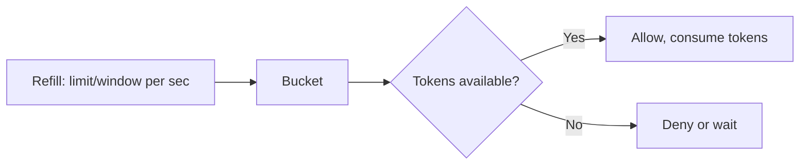

# Algorithms

## Token Bucket

The default algorithm. A bucket holds tokens that refill at a steady rate. Each request consumes tokens. Bursts are allowed up to the bucket capacity.



**Storage format:** `(remaining_tokens: float, last_refill_time: float)`

**Use when:** Your API allows occasional bursts but enforces an average rate over time.

```python
@limiter.limit("100/minute", algorithm=AlgorithmType.TOKEN_BUCKET)
```

## Sliding Window Counter

Estimates the count in the current window by combining the previous and current window counts with a weighted formula.

**Formula:**

```
estimated_count = prev_count * ((window - elapsed) / window) + curr_count
```

**Use when:** You need accurate rate limiting without boundary burst issues.

```python
@limiter.limit("100/minute", algorithm=AlgorithmType.SLIDING_WINDOW)
```

## Fixed Window Counter

Counts requests in fixed time windows. Simplest algorithm.

**Use when:** You need simplicity and low memory, and can tolerate the boundary burst issue.

```python
@limiter.limit("100/minute", algorithm=AlgorithmType.FIXED_WINDOW)
```

**Boundary burst:** Fixed windows can allow up to 2x the limit at window edges.

## Comparison

| Feature | Token Bucket | Sliding Window | Fixed Window |
|---------|-------------|----------------|--------------|
| Bursts | Yes | No | At boundaries |
| Accuracy | Good | Best | Good (except boundaries) |
| Memory | 2 values/key | 2 counters/key | 1 counter/key |

## Cost-aware limiting

```python
@app.post("/api/upload")
@limiter.limit("1000/minute")
async def upload_file(request: Request):
    size = len(await request.body())
    return {"uploaded": size}
```

## Blocking mode

Wait for a slot instead of denying immediately:

```python
@limiter.limit("10/minute", block=True, timeout=5.0)
async def slow_endpoint():
    return {"data": "value"}
```
