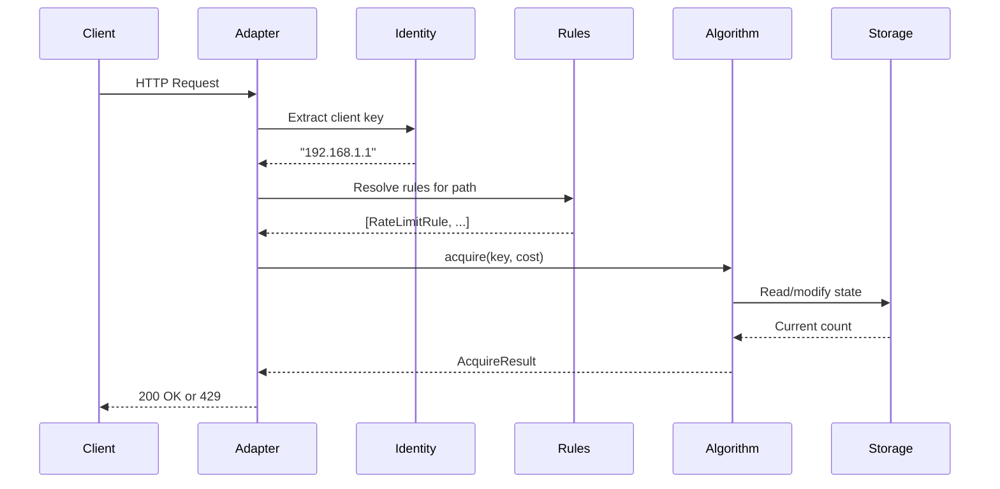

# Architecture

## Request flow



## Module structure

```
drogue/
    core/                    # Rate limiting engine
        algorithms/          # Token Bucket, Sliding Window, Fixed Window
        identity/            # Client identification (IP, user, header)
        rules/               # Rule parsing and resolution
        storage/             # Memory and Redis backends
        config.py            # All configuration options
        errors.py            # Exception hierarchy
        headers.py           # HTTP header injection

    adapters/                # Framework integrations
        fastapi/             # ASGI middleware, decorators, WebSocket
        django/              # Middleware, decorators, DRF throttle
        flask/               # Decorators, before_request hook

    protection/              # Security features
        ddos.py              # Z-score anomaly detection
        ban.py               # Progressive auto-ban
        trust.py             # Trust state machine
        circuit.py           # Circuit breaker
        probes.py            # Probe pattern detection
        cidr.py              # CIDR filtering
        adaptive.py          # System-metric-based limits
        sentinel.py          # Half-Space Trees streaming detection

    defense/                 # Adversarial defenses
        randomizer.py        # Per-session randomization, honeypots

    storage/                 # Advanced storage structures
        probabilistic.py     # Count-Min Sketch, Bloom, Cuckoo, HyperLogLog

    observability/           # Monitoring
        metrics.py           # Prometheus-compatible metrics
        logging.py           # Structured JSON logging
        opentelemetry.py     # OTEL tracing and metrics
```

## Extension points

### Custom storage

```python
from drogue.core.abstracts import Storage

class MyStorage(Storage):
    async def initialize(self) -> None: ...
    async def close(self) -> None: ...
    async def incr(self, key: str, window: float, amount: int = 1) -> int: ...
```

### Custom identity extractor

```python
from drogue.core.abstracts import IdentityExtractor

class MyExtractor(IdentityExtractor):
    async def extract(self, context: dict) -> str:
        return context["headers"].get("x-api-key", "anonymous")
```

### Custom algorithm

```python
from drogue.core.abstracts import Algorithm, AcquireResult

class MyAlgorithm(Algorithm):
    async def acquire(self, key: str, cost: int = 1, ...) -> AcquireResult: ...
    async def peek(self, key: str) -> AcquireResult: ...
    async def reset(self, key: str) -> None: ...
```

## Thread safety

- **MemoryStorage** uses `threading.RLock`
- **RedisStorage** uses atomic Redis operations (pipelines, Lua scripts)
- **Algorithms** use `compare_and_swap` for optimistic concurrency
- **Protection modules** are thread-safe via internal locks
