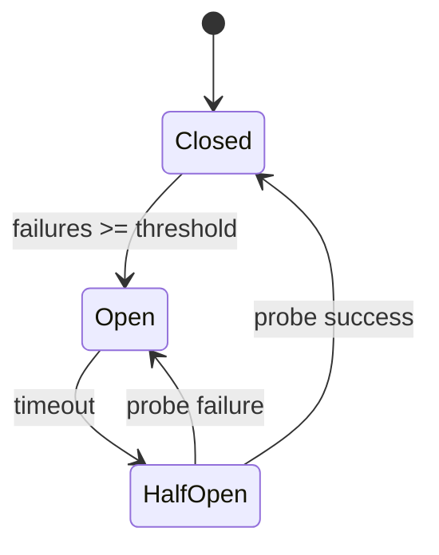

# Circuit Breaker

## States



| State | Behavior |
|-------|----------|
| Closed | Normal operation, requests pass through |
| Open | All requests denied immediately |
| HalfOpen | Allows one probe request |

## Enable

```python
from drogue.core.config import DrogueConfig

config = DrogueConfig(
    circuit_enabled=True,
    circuit_failure_threshold=5,
    circuit_recovery_timeout=30.0,
)
```

## Configuration

| Option | Default | Description |
|--------|---------|-------------|
| `circuit_enabled` | `False` | Enable circuit breaker |
| `circuit_failure_threshold` | `5` | Failures before opening |
| `circuit_recovery_timeout` | `30.0` | Seconds before half-open |

## Standalone usage

```python
from drogue.protection.circuit import CircuitBreaker

breaker = CircuitBreaker(failure_threshold=5, recovery_timeout=30.0)

# Check state
if breaker.state.value == "open":
    print("Circuit is open")

# Record outcomes
breaker.record_success()
breaker.record_failure()
```
