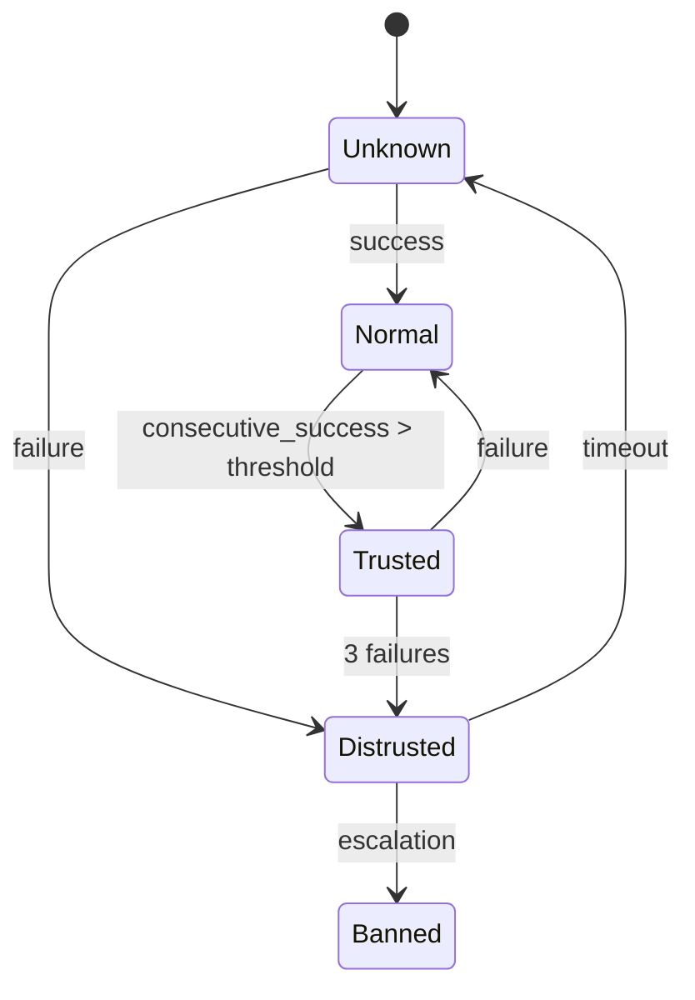

# Trust State Machine

## States



| State | Meaning |
|-------|---------|
| Unknown | New client, no history |
| Normal | Passing requests |
| Trusted | Verified via proof-of-work |
| Distrusted | Suspicious activity detected |
| Banned | Blocked |

## Enable

```python
from drogue.core.config import DrogueConfig

config = DrogueConfig(
    trust_enabled=True,
    trust_ttl=3600.0,         # 1 hour
    trust_max_size=100_000,
)
```

## State transitions

| Trigger | From | To |
|---------|------|----|
| Request succeeds | Unknown | Normal |
| Request fails | Unknown | Distrusted |
| `consecutive_successes > trusted_threshold` | Normal | Trusted |
| Request fails | Trusted | Normal (or Distrusted after 3) |
| Request fails | Distrusted | Banned |
| TTL expires | Distrusted | Unknown |

## Standalone usage

```python
from drogue.protection.trust import TrustManager

manager = TrustManager(config)

# Check state
state = manager.get_state("client_abc")  # "unknown"

# Record events
manager.record_success("client_abc")
manager.record_failure("client_abc")

# Force state
manager.set_state("client_abc", "trusted")
```
